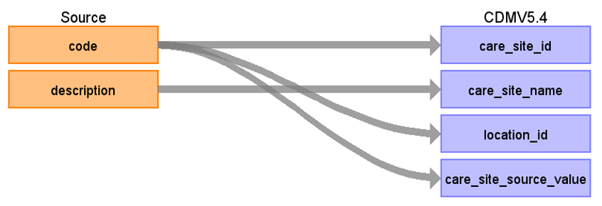

# CDM Table name: CARE_SITE

## Reading from UKB.lookup626

| Destination Field | Source field | Logic | Comment field |
| --- | --- | --- | --- |
| care_site_id | lookup626.code | | [Data-Coding 626](https://biobank.ndph.ox.ac.uk/ukb/coding.cgi?id=626) is the data provider for GP information that provides rigid GP location.|
| care_site_name | lookup626.description | | |
| place_of_service_concept_id | | [**8977** - Public Health Clinic](https://athena.ohdsi.org/search-terms/terms/8977) | |
| location_id | lookup626.code | linking to CDM Location | |
| care_site_source_value | | lookup626.code | |
| place_of_service_source_value| | | NULL |
