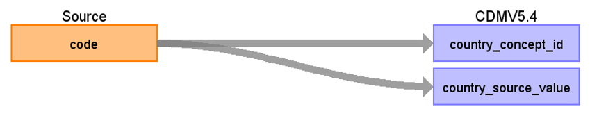

# CDM Table name: LOCATION

## Reading from UKB.lookup626

[Data-Coding 626](https://biobank.ndph.ox.ac.uk/ukb/coding.cgi?id=626) is the data provider for GP information that provides rigid GP location.
The GP location is present by mapping this data field to CDM Location and linking it to CDM Care_Site and CDM Provider.  

| Destination Field | Source field | Logic | Comment field |
| --- | --- | --- | --- |
| location_id | | | Autogenerate |
| address_1| | | NULL |
| address_2| | | NULL |
| city| | | NULL |
| state| | | NULL |
| zip| | | NULL |
| county| | | NULL |
| location_source_value| | | NULL |
| country_concept_id | lookup626.code | [Data-Coding 626](https://biobank.ndph.ox.ac.uk/ukb/coding.cgi?id=626) will be mapped to Geography Concept_id by using UKB_GP_COUNTRY_STCM |
| country_source_value | target_concept_name | using the mapped Geography concept name|
| latitude| | | NULL |
| longitude| | | NULL |