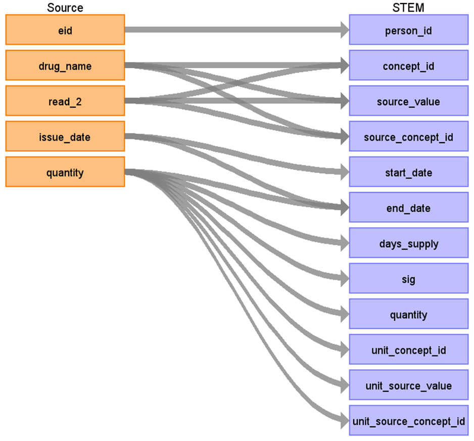
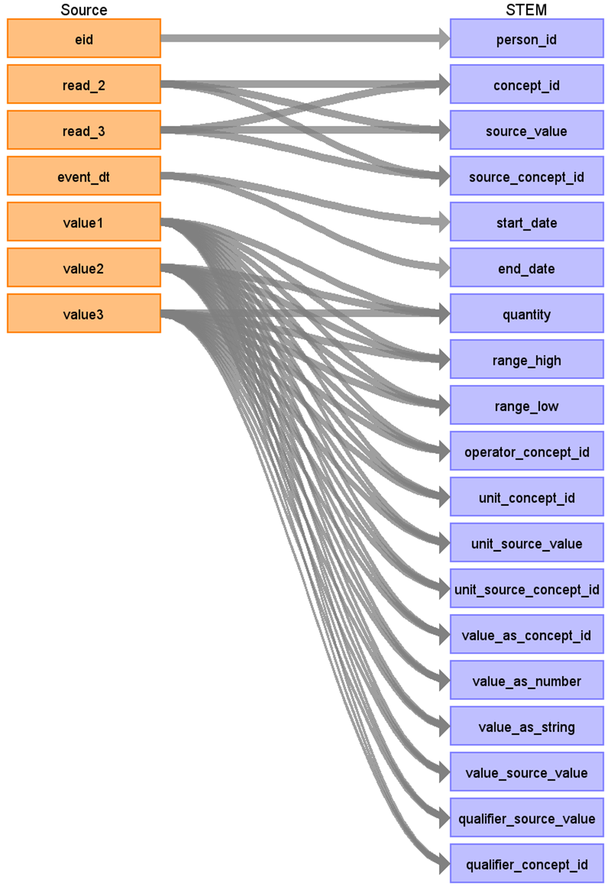

# CDM Table name: stem_table

The STEM table is a staging area where CPRD source codes like Read codes will first be mapped to concept_ids. The STEM table itself is an amalgamation of the OMOP event tables to facilitate record movement. This means that all fields present across the OMOP event tables are present in the STEM table. After a record is mapped and staged, the domain of the concept_id dictates which OMOP table (Condition_occurrence, Drug_exposure, Procedure_occurrence, Measurement, Observation, Device_exposure) the record will move to. Please see the STEM -> CDM mapping files for a description of which STEM fields move to which STEM tables. 

**Fields in the STEM table**

| Field |
| --- |
| id | 
| domain_id |  
| person_id | 
| visit_occurrence_id | 
| visit_detail_id |
| concept_id | 
| source_value |
| source_concept_id |
| type_concept_id | 
| start_date |  
| end_date |  
| start_time | 
| days_supply |
| sig |
| quantity |
| value_as_number |
| value_as_string |
| value_as_concept_id |
| range_low |
| range_high |
| operator_concept_id |
| qualifier_source_value |
| qualifier_concept_id |
| unit_source_value |
| unit_source_concept_id |
| measurement_event_id | 
| meas_event_field_concept_id |
| stem_source_table |
| stem_source_id |

## Reading from ukb_gp.temp_gp_scripts_2 (created by linking ukb_gp.gp_scripts to CDM GOLD lookup tables) 
Day supply information for prescriptions is essential for constructing the CDM Drug_era. However, in the source data, less than 1% of prescription records include this information. 
To address this gap, a 'numdays' value as the day supply in CDM Drug_exposure has been assigned by linking the source data with three CDM GOLD lookup tables: ****gold_product****, ****gold_daysupply_decodes****, ****gold_daysupply_modes****. 
These tables contain dmd code, pharmacy product name, and the most frequent prescriptions based on quantity, and pack size. 
This approach leverages the common data source between CPRD Gold and the UK Biobank, both of which use Vision® software. 
****Researchers must decide whether to use the suggested day supply or define it independently.****

| Destination Field | Source field | Logic | Comment field | 
| --- | --- | --- | --- |
| id | | | Autogenerate| 
| domain_id | | This should be the domain_id of the standard concept in the concept_id field. If an entity type is mapped to concept_id 0, put the domain_id as Observation. |
| person_id | eid |  |  | 
| visit_occurrence_id | | from visit_detail  |  | 
| visit_detail_id | | | |
| concept_id | drug_name read_2 | COALESCE(t2.source_code, t3.source_code, t1.drug_name, t1.read_2) | |
| source_value | drug_name read_2 | COALESCE(t2.source_code, t3.source_code, t1.drug_name, t1.read_2) |
| source_concept_id | | 0 |
| type_concept_id | | [****32817 - EHR****](https://athena.ohdsi.org/search-terms/terms/32817) |
| start_date | issue_date | |
| end_date | issue_date day_supply | issue_date + COALESCE(t1.days_supply, 0) |
| start_time | | 00:00:00 |
| days_supply| quantity | | day supply information in quantity: week * 7 month * 28   if day supply information doesn't exists, use numdays provided by CDM GOLD lookup tables. |
| sig | quantity | | for reference |  
| quantity | quantity | | |
| unit_source_value | quantity | | 
| stem_source_table | | gp_scripts | |
| stem_source_id | gp_scripts.id | |

## Reading from ukb_gp.gp_clinical

| Destination Field | Source field | Logic | Comment field | 
| --- | --- | --- | --- |
| id | | | Autogenerate| 
| domain_id | | This should be the domain_id of the standard concept in the concept_id field. If an entity type is mapped to concept_id 0, put the domain_id as Observation. |
| person_id | eid |  |  | 
| visit_occurrence_id | | from visit_detail  |  | 
| visit_detail_id | | | |
| concept_id | read_3 | | |
| source_value | read_3 | | |
| source_concept_id | | concept_id represent source_value in Athena or 0 |
| type_concept_id | | [****32817 - EHR****](https://athena.ohdsi.org/search-terms/terms/32817) |
| start_date | event_dt | |
| end_date | event_dt | |
| start_time | | 00:00:00 |
| quantity | value1 value2 value3 | If domain_id = 'Drug' then | 
| range_high | value1 value2 value3 | | 
| range_low | value1 value2 value3 | | 
| operator_concept_id | value1 value2 value3 | | 
| unit_concept_id | |
| unit_source_value | value1 value2 value3 | |  
| unit_source_concept_id | |
| value_as_concept_id | value1 value2 value3 | |  
| value_as_number | value1 value2 value3 | |  
| value_as_string | value1 value2 value3 | |  
| value_source_value | value1 value2 value3 | |  
| qualifier_source_value | value1 value2 value3 | |  
| qualifier_concept_id | value1 value2 value3 | |  
| stem_source_table | | gp_clinical | |
| stem_source_id | gp_clinical.id | |