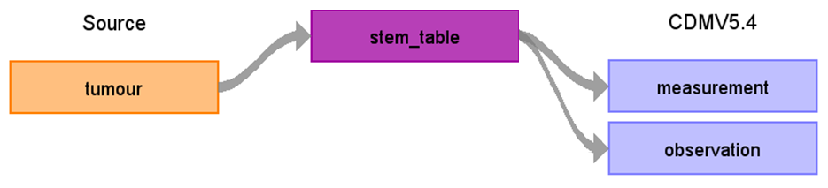

# CDM Table name: stem_table

## Reading from NCRAS.tumour
**ONLY NCRAS data within the linkage_coverage period and valid in the database linked (i.e. patients do not exists in the source_nok) to are used in our mapping.**

All cancer diagnoses are ideally mapped to the CDM Condition. Cancer modifiers, which include additional diagnostic details such as stage and grade, should be mapped to the CDM Measurement domain. 
These modifiers are linked to the corresponding cancer diagnosis using the measurement_event_id field, which is set to the respective condition_occurrence_id, and the meas_event_field_concept_id, which is assigned the concept ID =[1147127](https://athena.ohdsi.org/search-terms/terms/1147127).
However, some cancer modifiers may not be adequately represented by Athena Measurement concepts. In cases where mapping to the CDM Measurement domain is not feasible, these modifiers are mapped instead to the CDM Observation domain. 

## Cancer Modifiers

Fields in the STEM table

| Field		          |
| --- 				  |
| id				  |
| person_id           | 
| visit_occurrence_id | 
| visit_detail_id     | 
| source_value        | 
| source_concept_id   | 
| type_concept_id     | 
| start_date          | 
| end_date            | 
| start_time          | 
| value_as_number     | 
| unit_source_value   | 
| value_source_value  | 
| stem_source_table   | 
| stem_source_id      | 

| Destination Field | Source field | Logic | Comment field |
| --- | --- | --- | --- |
| id |  | | Autogenerate |
| person_id | e_patid | | |
| visit_occurrence_id | | from visit_detail | |
| visit_detail_id | e_cr_id 'tumour' | Look up visit_detail_id based on the unique combination of e_cr_id and source table name | |
| source_value | tumoursize nodesexcised, nodesinvolved tumourcount, bigtumourcount chrl_tot_27_03, chrl_tot_78_06 grade stage_best, stage_img, stage_path t_best, n_best, m_best t_img, n_img, m_img t_path, n_path, m_path gleason_primary, gleason_secondary, gleason_tertiary, gleason_combined | | |
| source_concept_id | | | |
| type_concept_id | basisofdiagnosis | | |
| start_date | diagnosisdatebest | | |
| end_date | diagnosisdatebest | | |
| start_time | | '00:00:00' | |
| value_as_number     | tumoursize nodesexcised, nodesinvolved tumourcount, bigtumourcount chrl_tot_27_03, chrl_tot_78_06 grade stage_best_system, stage_best, stage_img, stage_path stage_img_system, t_best, n_best, m_best t_img, n_img, m_img stage_path_system, t_path, n_path, m_path gleason_primary, gleason_secondary, gleason_tertiary, gleason_combined | | | 
| unit_source_value   | | 'mm' for tumoursize 'month' for chrl_tot_27_03 and chrl_tot_78_06 | | 
| value_source_value  | source data field name | | There are 3 sets of AJCC/UICC code in source data indentified by prefix(e.g. best_, img_, and path_) in the source data field name  | 
| stem_source_table   | | 'Tumour-[modifier name]'  | | 
| stem_source_id      | e_cr_id | | | 

NCRAS_TUMOUR_MODIFIER_STCM
NCRAS_TUMOUR_GRADE_STCM
NCRAS_TUMOUR_GLEASON_PRI_STCM
NCRAS_TUMOUR_GLEASON_SEC_STCM
NCRAS_TUMOUR_GLEASON_TER_STCM
NCRAS_TUMOUR_BASIS_DIAG_STCM

